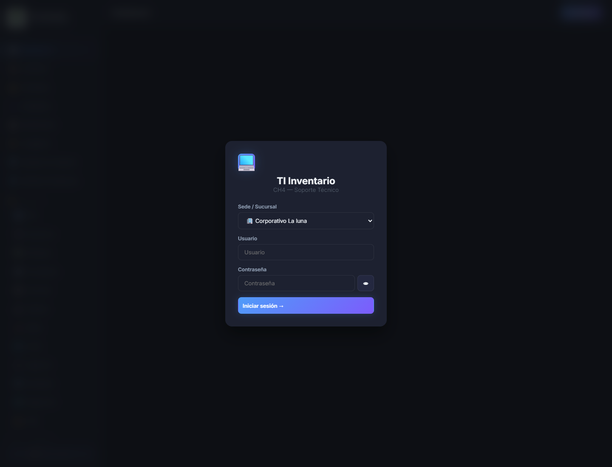

# TI Inventario

## Resumen

TI Inventario es una plataforma interna para control de activos, stock, prestamos, equipo de computo y recursos de TI. Esta version publica resume el alcance funcional del proyecto sin exponer infraestructura, credenciales ni datos operativos sensibles.

## Alcance funcional

- inicio de sesion protegido
- seleccion de sede o contexto de trabajo
- dashboard de inventario y alertas
- gestion de articulos y categorias
- prestamos y seguimiento de devoluciones
- control de empleados
- historial de movimientos
- inventario de equipo de computo
- referencias QR para activos e inventario
- catalogo de recursos de TI

## Stack tecnico

- Frontend: HTML, CSS y JavaScript
- Backend: Node.js con Express
- Persistencia: datasets estructurados para operacion interna
- QR: generacion desde navegador

## Flujo de uso

1. El usuario inicia sesion con una cuenta autorizada.
2. Selecciona la sede o contexto de trabajo.
3. Revisa alertas y resumen general en el dashboard.
4. Administra inventario, prestamos, empleados y equipos.
5. Genera referencias QR para consulta o identificacion rapida.

## Captura publica

Vista de acceso:

## Nota de publicacion

- Esta documentacion fue sanitizada para GitHub.
- Se omitieron IPs, nombres internos, credenciales y pantallas con datos operativos reales.
- La documentacion detallada y privada se conserva fuera de este repositorio.
